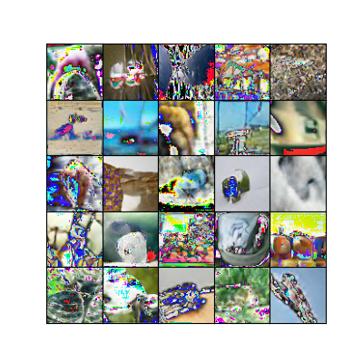

# [MaskGIT: Masked Generative Image Transformer](https://arxiv.org/pdf/2202.04200.pdf)

Huiwen Chang, Han Zhang, Lu Jiang, Ce Liu, William T. Freeman

*CVPR 2022*




This folder provides a re-implementation of this paper in PyTorch, developed as part of the course METU CENG 796 - Deep Generative Models. The re-implementation is provided by:
* Ardan Yılmaz, yilmaz.ardan@metu.edu.tr
* Şahin Umutcan Üstündaş, umutcan.ustundas@metu.edu.tr

Please see the jupyter notebook file [main.ipynb](main.ipynb) for a summary of paper, the implementation notes and our experimental results.


## Installation
The required packages can be installed via conda environment with the code snippet below:
```
conda create --name maskgit --file requirements.txt
```

Then, the datasets and pretrained models can be downloaded with the below snippet:

```
bash download_data.sh
```

Model can be trained from scratch via provided jupyter notebook, or via command line with the code snippet below:

```
python trainer.py train
```

To run the training with different parameters, check the trainer.py script, or:

```
python trainer.py --help
```